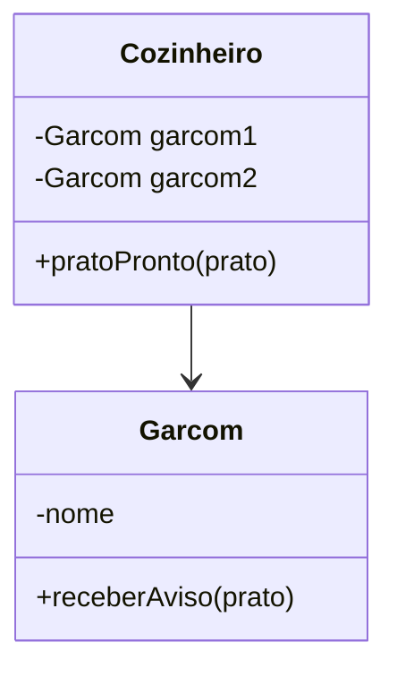

# Acoplamento Forte como Anti-pattern do Observer Pattern

## Contexto: Sistema de Restaurante

No contexto de um restaurante, o **Observer Pattern** seria útil para permitir que o *cozinheiro* notifique automaticamente os *garçons* quando um prato fica pronto.

Mas quando implementado com **acoplamento forte**, o sistema perde flexibilidade e se torna difícil de manter.

---

## O que é Acoplamento Forte?

O **acoplamento forte** ocorre quando uma classe depende diretamente de outras classes concretas, ao invés de depender de **interfaces** ou **abstrações**.

No contexto do Observer Pattern, isso significa que o *sujeito* (cozinheiro) conhece especificamente cada *observador* (garçom).

---

## Por que isso é um Anti-pattern?

### Problemas principais

- **Alta dependência entre classes**
- **Baixa reutilização**
- **Dificuldade de extensão**
- **Quebra do Princípio Aberto/Fechado (OCP)**
- **Testes mais difíceis**

---

## UML — Acoplamento Forte



---

## Exemplo em Java (Anti-pattern)

```java
// Sujeito com acoplamento forte: conhece cada garçom concreto
public class Cozinheiro {
    private Garcom garcom1;
    private Garcom garcom2;

    public Cozinheiro(Garcom garcom1, Garcom garcom2) {
        this.garcom1 = garcom1;
        this.garcom2 = garcom2;
    }

    // Notifica diretamente os garçons concretos
    public void pratoPronto(String prato) {
        garcom1.receberAviso(prato);
        garcom2.receberAviso(prato);
    }
}

// Observador concreto (sem interface genérica)
public class Garcom {
    private String nome;

    public Garcom(String nome) {
        this.nome = nome;
    }

    public void receberAviso(String prato) {
        System.out.println(nome + " foi avisado: prato '" + prato + "' está pronto!");
    }
}

// Classe principal demonstrando o problema
public class Main {
    public static void main(String[] args) {
        Garcom joao = new Garcom("João");
        Garcom maria = new Garcom("Maria");

        // Cozinheiro está rigidamente acoplado aos garçons
        Cozinheiro cozinheiro = new Cozinheiro(joao, maria);

        // Para adicionar um novo garçom, seria necessário alterar Cozinheiro
        cozinheiro.pratoPronto("Lasanha");
    }
}
```

---

## Conclusão

Ao acoplar diretamente o sujeito (cozinheiro) aos observadores (garçons), perdemos:

- Flexibilidade
- Extensibilidade
- Facilidade de teste
- Reutilização

Esse tipo de implementação é considerado um **Anti-pattern** no Observer Pattern.
