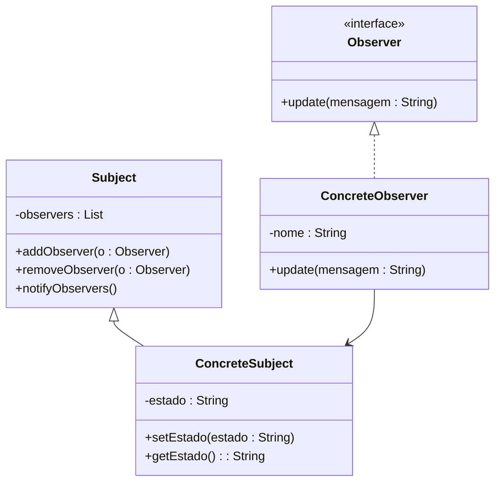

# Padrão Observer (Observador)

## O que é o Observer?

O **Observer (Observador)** é um **padrão de projeto comportamental** que define uma **dependência um-para-muitos** entre objetos.  
Quando o **objeto observado (Subject)** muda de estado, **todos os seus observadores (Observers)** são **notificados automaticamente**.

O objetivo é **desacoplar** o objeto que gera um evento dos objetos que reagem a ele, mantendo o código mais **flexível** e **modular**.

---

## Estrutura do Padrão

### UML Simplificado



---

## Funcionamento

1. O **Subject (Assunto)** mantém uma lista de **Observers** interessados.  
2. Quando ocorre uma **mudança de estado** no **Subject**, ele chama o método `notifyObservers()`.  
3. O **Subject** notifica todos os **Observers**, enviando as informações necessárias.  
4. Cada **Observer** reage de forma independente à notificação.

---

## Exemplo em Java

### Interface `Observer.java`
```java
public interface Observer {
    void update(String mensagem);
}
```

---

### Classe `Subject.java`
```java
import java.util.ArrayList;
import java.util.List;

public class Subject {
    private List<Observer> observers = new ArrayList<>();
    private String estado;

    public void addObserver(Observer observer) {
        observers.add(observer);
    }

    public void removeObserver(Observer observer) {
        observers.remove(observer);
    }

    public void setEstado(String estado) {
        this.estado = estado;
        notifyObservers();
    }

    public String getEstado() {
        return estado;
    }

    private void notifyObservers() {
        for (Observer observer : observers) {
            observer.update(estado);
        }
    }
}
```

---

### Classe `ConcreteObserver.java`
```java
public class ConcreteObserver implements Observer {
    private String nome;

    public ConcreteObserver(String nome) {
        this.nome = nome;
    }

    @Override
    public void update(String mensagem) {
        System.out.println(nome + " recebeu a atualização: " + mensagem);
    }
}
```

---

### Classe `Main.java`
```java
public class Main {
    public static void main(String[] args) {
        Subject subject = new Subject();

        Observer obs1 = new ConcreteObserver("Observador 1");
        Observer obs2 = new ConcreteObserver("Observador 2");
        Observer obs3 = new ConcreteObserver("Observador 3");

        subject.addObserver(obs1);
        subject.addObserver(obs2);
        subject.addObserver(obs3);

        subject.setEstado("Novo estado definido!");
        subject.setEstado("Outro estado atualizado!");
    }
}
```

---

## Saída Esperada

```
Observador 1 recebeu a atualização: Novo estado definido!
Observador 2 recebeu a atualização: Novo estado definido!
Observador 3 recebeu a atualização: Novo estado definido!
Observador 1 recebeu a atualização: Outro estado atualizado!
Observador 2 recebeu a atualização: Outro estado atualizado!
Observador 3 recebeu a atualização: Outro estado atualizado!
```

---

## Fluxo de Execução

1. O **Main** cria o `Subject` (objeto observado) e os `Observers`.  
2. Os `Observers` são **registrados** no `Subject` com `addObserver()`.  
3. Quando o `Subject` muda de estado (`setEstado()`), ele **notifica todos os Observers**.  
4. Cada `Observer` **recebe e processa** a atualização através do método `update()`.

---

## Benefícios do Padrão Observer

- **Desacoplamento** entre quem emite o evento e quem reage a ele.  
- **Reutilização e flexibilidade** — fácil adicionar novos observadores sem alterar o código do `Subject`.  
- **Comunicação automática** entre objetos.  
- **Extensível** — suporta múltiplos tipos de eventos e observadores.
