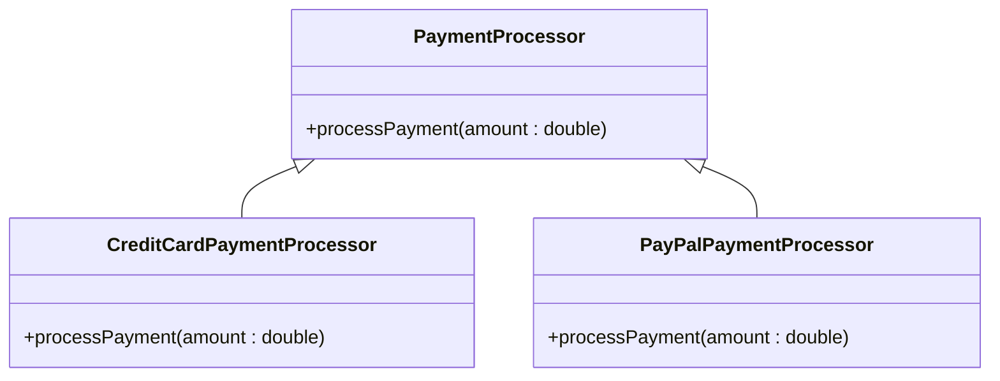

# Herança como Anti-pattern do Strategy Pattern

## O que é Herança?

A **herança** é um mecanismo da **programação orientada a objetos (POO)** onde uma classe (**subclasse**) herda atributos e métodos de outra (**superclasse**).  
Embora seja útil em muitos cenários, seu uso incorreto para variar comportamentos pode levar a um **design frágil, rígido e difícil de manter**.

---

## Por que é um Anti-pattern no contexto do Strategy Pattern?

Quando usada para implementar **variações de comportamento**, a herança apresenta diversos **problemas** que o **Strategy Pattern** resolve de forma mais elegante.  
Em vez de herdar diferentes comportamentos, o Strategy permite **trocar dinamicamente o comportamento de um objeto**, evitando a criação de inúmeras subclasses.

---

## Problemas da Herança em Variação de Comportamento

### 1. Crescimento descontrolado da hierarquia de classes  
Cada novo comportamento exige a criação de uma nova subclasse, aumentando a complexidade.

### 2. Baixa reutilização de código  
Comportamentos semelhantes acabam sendo duplicados em diferentes subclasses.

### 3. Rigidez no design  
A herança só permite **uma superclasse por vez** (na maioria das linguagens), limitando a flexibilidade e dificultando extensões.

### 4. Viola o Princípio Aberto/Fechado (OCP)  
Adicionar um novo comportamento exige **modificar ou estender** a hierarquia, quebrando o princípio de **aberto para extensão, fechado para modificação**.

### 5. Testes difíceis  
Comportamentos fortemente acoplados à herança tornam os **testes unitários** mais complexos, já que dependem da hierarquia completa.

---

## Diagrama UML Simplificado



---

## Exemplo em Java

```java
// Superclasse base para processadores de pagamento
public abstract class PaymentProcessor {
    public abstract void processPayment(double amount);
}

// Cada novo comportamento exige uma nova subclasse.
public class CreditCardPaymentProcessor extends PaymentProcessor {
    @Override
    public void processPayment(double amount) {
        System.out.println("Pagando R$" + amount + " com cartão de crédito.");
    }
}

public class PayPalPaymentProcessor extends PaymentProcessor {
    @Override
    public void processPayment(double amount) {
        System.out.println("Pagando R$" + amount + " com PayPal.");
    }
}

// Classe principal demonstrando o problema
public class Main {
    public static void main(String[] args) {
        PaymentProcessor processor = new CreditCardPaymentProcessor();
        processor.processPayment(100.0);

        // Trocar o comportamento exige trocar a classe inteira.
        // Não é possível trocar o comportamento em tempo de execução sem criar nova instância.
        processor = new PayPalPaymentProcessor();
        processor.processPayment(75.5);
    }
}
```

---

## Análise do Problema

- A classe `PaymentProcessor` **força** o uso da herança para definir comportamentos diferentes.  
- Para cada novo método de pagamento, é necessário **criar uma nova subclasse**.  
- O código cliente (`Main`) precisa **saber qual classe concreta instanciar**, o que **aumenta o acoplamento**.  
- Não é possível **alterar o comportamento em tempo de execução** — apenas trocando de classe.

---

## Solução com Strategy Pattern

Em vez de criar subclasses para cada variação, o **Strategy Pattern** propõe definir uma **interface comum** (`PaymentStrategy`) e implementar diferentes estratégias (como `CreditCardStrategy`, `PayPalStrategy`, etc).  
Assim, o comportamento pode ser **trocado dinamicamente**, sem modificar o código existente.

---

## Benefícios da Substituição pela Estratégia

- Reduz a **duplicação de código**.  
- Aumenta a **reutilização e flexibilidade**.  
- Segue o **Princípio Aberto/Fechado (OCP)**.  
- Facilita **testes unitários**, pois cada estratégia é independente.  
- Permite **alterar comportamentos em tempo de execução** sem mudar a estrutura das classes.

---

## Comparação entre Herança e Strategy

| Aspecto | Herança | Strategy Pattern |
|----------|----------|------------------|
| Extensão de comportamento | Por subclasses | Por composição |
| Flexibilidade em tempo de execução | Baixa | Alta |
| Reutilização de código | Limitada | Alta |
| Acoplamento | Forte | Fraco |
| Testabilidade | Difícil | Fácil |

---

## Conclusão

O uso da **herança para variar comportamentos** pode parecer simples no início, mas torna o sistema **difícil de manter e expandir**.  
O **Strategy Pattern** oferece uma alternativa muito mais **modular, flexível e reutilizável**, permitindo que novos comportamentos sejam adicionados sem quebrar o código existente.
