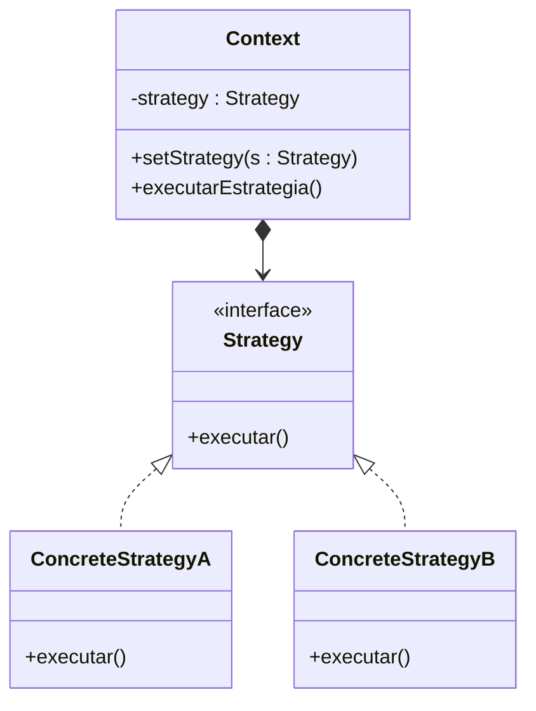

# Padrão Strategy (Estratégia)

## O que é o Strategy?

O **Strategy (Estratégia)** é um **padrão de projeto comportamental** que permite **definir uma família de algoritmos**, **encapsulá-los** e **torná-los intercambiáveis**.  
Com isso, o algoritmo pode variar **independentemente do cliente** que o utiliza.

O objetivo é **separar o comportamento** do objeto que o utiliza, facilitando **extensões** e **modificações** sem alterar o código existente.

---

## Estrutura do Padrão

### UML Simplificado



---

## Funcionamento

1. O **Strategy** define uma **interface comum** para todas as estratégias.  
2. Cada **ConcreteStrategy** implementa essa interface com um comportamento diferente.  
3. O **Context** armazena uma referência a um objeto **Strategy** e o utiliza para executar a ação.  
4. O comportamento pode ser alterado **dinamicamente**, trocando a estratégia em tempo de execução.

---

## Exemplo em Java

### Interface `Strategy.java`
```java
public interface Strategy {
    void executar();
}
```

---

### Classe `ConcreteStrategyA.java`
```java
public class ConcreteStrategyA implements Strategy {
    @Override
    public void executar() {
        System.out.println("Executando estratégia A: Ordenação crescente.");
    }
}
```

---

### Classe `ConcreteStrategyB.java`
```java
public class ConcreteStrategyB implements Strategy {
    @Override
    public void executar() {
        System.out.println("Executando estratégia B: Ordenação decrescente.");
    }
}
```

---

### Classe `Context.java`
```java
public class Context {
    private Strategy strategy;

    public void setStrategy(Strategy strategy) {
        this.strategy = strategy;
    }

    public void executarEstrategia() {
        if (strategy != null) {
            strategy.executar();
        } else {
            System.out.println("Nenhuma estratégia definida.");
        }
    }
}
```

---

### Classe `Main.java`
```java
public class Main {
    public static void main(String[] args) {
        Context context = new Context();

        Strategy estrategiaA = new ConcreteStrategyA();
        Strategy estrategiaB = new ConcreteStrategyB();

        context.setStrategy(estrategiaA);
        context.executarEstrategia();

        context.setStrategy(estrategiaB);
        context.executarEstrategia();
    }
}
```

---

## Saída Esperada

```
Executando estratégia A: Ordenação crescente.
Executando estratégia B: Ordenação decrescente.
```

---

## Fluxo de Execução

1. O **Main** cria o `Context` e as estratégias (`ConcreteStrategyA` e `ConcreteStrategyB`).  
2. O **Context** define qual estratégia será usada através do método `setStrategy()`.  
3. Quando `executarEstrategia()` é chamado, o comportamento depende da estratégia atual.  
4. É possível **mudar a estratégia em tempo de execução**, tornando o código mais flexível.

---

## Benefícios do Padrão Strategy

- **Evita condicionais complexas** (como muitos `if/else` para escolher comportamentos).  
- **Facilita a extensão** — novas estratégias podem ser adicionadas sem alterar o código existente.  
- **Promove o princípio aberto/fechado** (Open/Closed Principle).  
- **Permite mudar o comportamento dinamicamente**.

